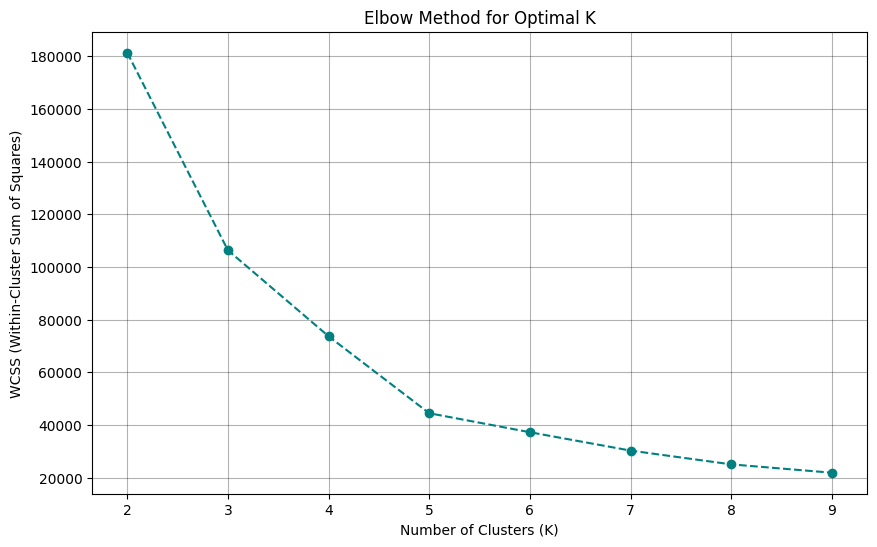
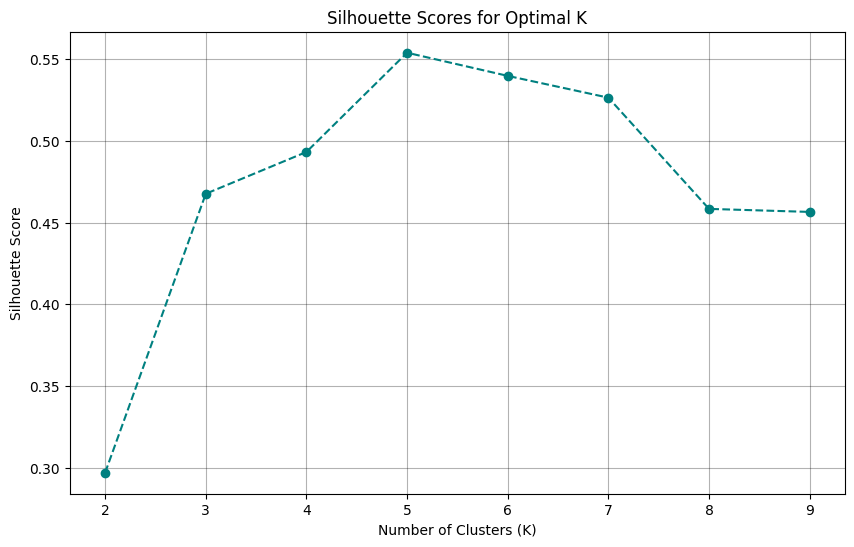
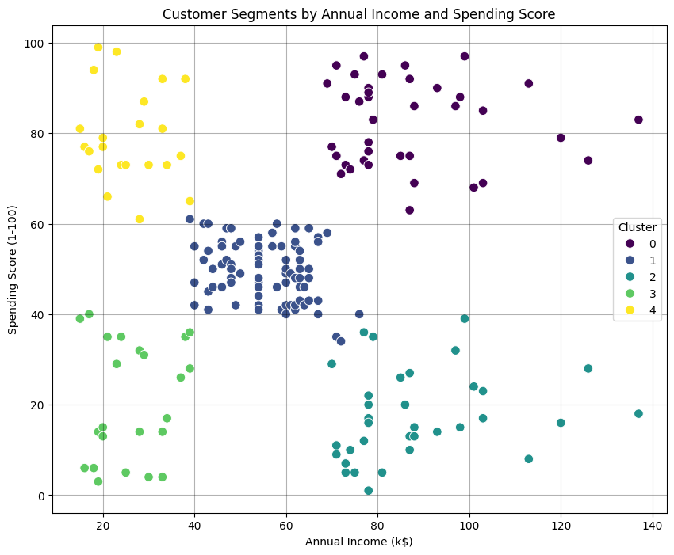
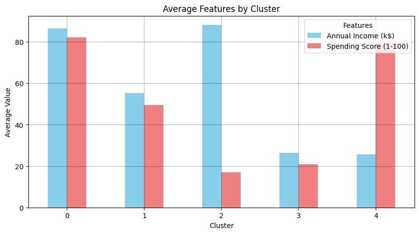

# Mall Customer Segmentation using K-Means Clustering

**Unsupervised machine learning project that segments 200 mall customers into 5 distinct groups based on their annual income and spending behavior. Achieved a silhouette score of 0.55.**

[](https://www.python.org/)

[](https://scikit-learn.org/)

[](https://opensource.org/licenses/MIT)

---

## 📌 Project Overview:

This Unsupervised Machine Learning project analyses a dataset of mall customers to identify distinct, actionable segments. By applying `K-Means Clustering`, the project groups customers by `Annual Income` and `Spending Score` to provide valuable insights for targeted marketing and business optimisation.

**The analysis includes:**

- **Exploratory Data Analysis (EDA):** Understanding customer demographics and underlying data distributions.
- **Optimal Cluster Determination:** Employing the `Elbow Method` and `Silhouette Analysis` to select the most appropriate number of clusters (5).
- **K-Means Clustering & Visualization:** Segmenting customers and providing a clear visual interpretation of the resulting groups.
- **Cluster Profiling & Business Insights:** Interpreting the characteristics of each customer segment (e.g., high-spenders, budget-conscious) to help the marketing team develop optimized, personalized strategies.

---

## 🎯 Key Visual Results

### Elbow Method

The Elbow Method was used to identify the optimal number of clusters by examining the `within-cluster sum of squares (WCSS)`.



*The "elbow" point strongly suggests k=5*

### Silhouette Scores

Silhouette analysis was performed to evaluate cluster cohesion and separation across different values of *K*.



*Silhouette analysis confirms K=5 as optimal with the highest score (0.5539), indicating well-separated and cohesive clusters.*

### Final Customer Segments Visualization 

Customers are segmented based on **Annual Income** and **Spending Score**, with each color representing a distinct cluster.



*The scatter plot reveals 5 distinct customer segments*

### Customer Segment Profiles 

The bar chart was used to summarize the average values of key features within each cluster, making interpretation straightforward.

 

| Cluster | Avg. Income (k$) | Avg. Spending Score | Customer Count | Profile |
|:-------:|:----------------:|:-------------------:|:--------------:|---------| 
| **0** | 86.54 | 82.13 | 39 | **High Income, High Spending** - Premium customers, target for luxury products | 
| **1** | 55.30 | 49.52 | 81 | **Moderate Income, Moderate Spending** - Average customers, largest segment | 
| **2** | 88.20 | 17.11 | 35 | **High Income, Low Spending** - Potential customers, focus on conversion | 
| **3** | 26.30 | 20.91 | 23 | **Low Income, Low Spending** - Budget-conscious, value-based marketing | 
| **4** | 25.73 | 79.36 | 22 | **Low Income, High Spending** - Aspirational buyers, credit/financing focus | 

#### Marketing Recommendations: 

- `Cluster 0 (Premium Customers):` - Target with exclusive offers and luxury products - VIP programs and personalized experiences - Highest profit potential 
- `Cluster 1 (Average Customers):` - Largest segment - focus on retention - Seasonal promotions and loyalty programs - Upselling opportunities 
- `Cluster 2 (Frugal Spenders):` - Understand barriers to spending - Targeted campaigns to increase engagement - High conversion potential
- `Cluster 3 (Budget Shoppers):` - Value-based marketing - Discount and clearance promotions - Volume-based strategies
- `Cluster 4 (Aspirational Buyers):` - Financing and instalment options - Trend-focused marketing - Credit card promotions 

### 📊 Additional Insights

#### Gender Distribution
- `Female customers:` 56% (112 customers)
- `Male customers:` 44% (88 customers)
- Females also show slightly higher average spending score `(51.5 vs 48.5)`

#### Age Demographics
- `Age range:` 18-70 years
- `Mean age:` 38.9 years
- High spenders are predominantly in the `25-35` age range

---

## 🔍 Methodology

This project employed a structured methodology to segment customer data using the `K-means clustering` algorithm, focusing on *Annual Income* and *Spending Score*.

### 1. Data Preprocessing and Feature Selection

The initial dataset was checked for missing values, none of which were detected. The non-essential feature, `CustomerID`, was dropped as it holds no predictive value for clustering. The analysis was then exclusively focused on two key numerical features: `Annual Income (k$)` and `Spending Score (1-100)`.

### 2. Optimal K Determination

The optimal number of clusters *(k)* was determined using two complementary techniques:

- **Elbow Method (WCSS):** The *Within-Cluster Sum of Squares (WCSS)* was calculated for k values ranging from 2 to 9. The "elbow" point, indicating the most significant reduction in WCSS levelling off, was visually identified at *k=5*.
- **Silhouette Analysis:** The *silhouette score* was computed for the same range of k values. The highest silhouette score of `0.5539` was achieved at *k=5*, which confirms that the data forms well-defined and separated clusters at this partition size.

### 3. K-means Clustering

The final segmentation was performed using the K-means algorithm with the following parameters:

- `Number of Clusters:` k=5
- `Initialization:` k-means++ (to speed up convergence and avoid poor local minima)
- `Max Iterations:` 300
- `Random State:` 70 (for reproducibility)

### 4. Cluster Interpretation and Profiling

Following the clustering, the *five* resulting segments were analyzed. This involved calculating the *mean values* for `Annual Income` and `Spending Score` for each cluster. Based on these distinct characteristics, *five unique business-oriented customer profiles* were developed to allow for targeted marketing strategies.

---

## 📂 Repository Structure

```
mall-customer-segmentation-kmeans/
├── data/
│   └── Mall_Customers.csv                        # Customer dataset (200 rows × 5 columns)
├── notebooks/
│   └── mall_customer_segmentation_kmeans.ipynb   # Complete analysis & clustering
├── figures/
│   ├── cluster_visualization.png                 # Final scatter plot of segments
│   ├── elbow_method.png                          # Graph to determine optimal K
│   ├── silhouette_scores.png                     # Validation of cluster quality
│   └── cluster_characteristics.png               # Barplot showing average features per cluster
├── requirements.txt                              # Python dependencies
├── .gitignore                                    # Git ignore file
├── LICENSE                                       # MIT License
└── README.md                                     # Project documentation
```

---

## 💻How to Run Locally and Reproduce Results

Follow these steps to set up the project, install dependencies, and run the analysis notebook:

1. **Clone the Repository**
```bash
git clone https://github.com/dlheghend/mall-customer-segmentation-kmeans.git
cd mall-customer-segmentation-kmeans
```
2. **Install Dependencies**
```bash
pip install -r requirements.txt
```
3. **Run the Notebook**
```bash
jupyter notebook notebooks/mall_customer_segmentation_kmeans.ipynb
```
The notebook will automatically load the dataset from `data/Mall_Customers.csv`.
You can also open the notebook using integrated tools like `VS Code` or `Jupyter Lab`.

---

## 💾 Dataset

- **About:** Mall Customer Segmentation Data
- **Records:** 200 customers
- **Features:** CustomerID, Gender, Age, Annual Income (k$), Spending Score (1-100)
- **Location:** `data/Mall_Customers.csv`

### Features Description:

- `CustomerID` - Unique identifier for each customer
- `Gender` - Customer gender (Male/Female)
- `Age` - Customer age (18-70 years)
- `Annual Income (k$)` - Annual income in thousands of dollars
- `Spending Score (1-100)` - Score assigned by the mall based on spending behavior and patterns

---

## 👤 Author

**DOUGLAS, Unyime-Abasi A.**

- X (Twitter): [@dz_unyimeabasi](https://x.com/dz_unyimeabasi)
- LinkedIn: [Unyime-Abasi Douglas](https://www.linkedin.com/in/unyimeabasi-douglas/)
- Email: fravicdouglas@gmail.com

---

<p align="center">
  <i>⭐ If you found this project helpful, please consider giving it a star!</i>
<p align="center">
  <i>Feedback and questions are welcome!</i>
</p>
</p>

